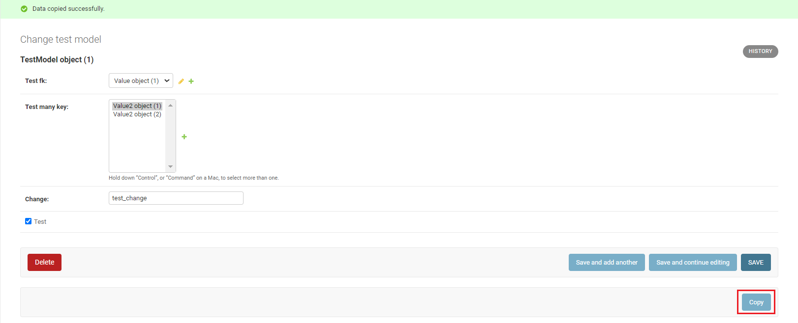
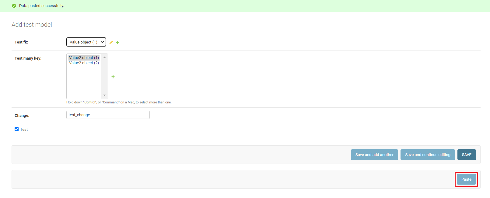

# django-form-copy


Library for quickly copying django objects from one to another project.


How to use:

1. Add library in `INSTALLED_APPS`.

```
INSTALLED_APPS = [
    ...
    "django_form_copy",
]
```
2. After added the application - just add a mixin `CopyPasteMixin` where you register your application 
for the admin panel.

```
# admin.py
from django_form_copy import CopyPasteMixin

@admin.register(YourModel)
class YourModelAdmin(CopyPasteMixin, admin.ModelAdmin):
    ...
    # your other attributes
```

After you want to copy an object, go to edit the model object and click the `Copy` button. 

Once the data is saved to the clipboard, you can go to any similar project and recreate this object.
For example, you use "stage" on another server or "localhost" on your personal computer.
Click on the "+" to add object in admin panel, click on the `Paste` button to recreate this object with 
all relations (including ForeignKey and ManyToMany - these will be created if not found on your other server).
